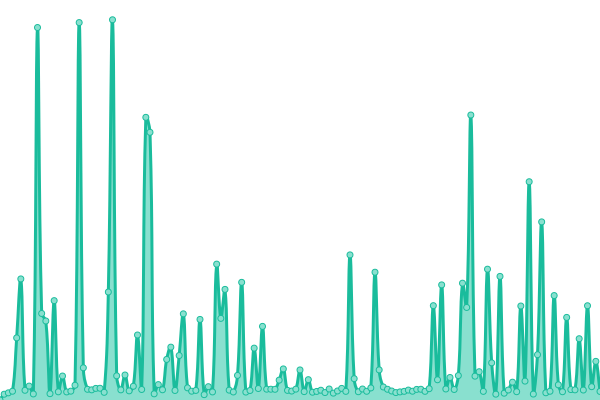
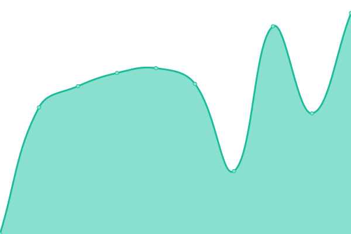

# [📈 Live Status](https://status.tedcrypto.io): <!--live status--> **🟧 Partial outage**

This repository contains the open-source uptime monitor and status page for [Tedcrypto.io](https://www.tedcrypto.io), powered by [Upptime](https://github.com/upptime/upptime).

With [Upptime](https://upptime.js.org), you can get your own unlimited and free uptime monitor and status page, powered entirely by a GitHub repository. We use [Issues](https://github.com/TedcryptoOrg/upptime/issues) as incident reports, [Actions](https://github.com/TedcryptoOrg/upptime/actions) as uptime monitors, and [Pages](https://status.tedcrypto.io) for the status page.

<!--start: status pages-->
<!-- This summary is generated by Upptime (https://github.com/upptime/upptime) -->
<!-- Do not edit this manually, your changes will be overwritten -->
<!-- prettier-ignore -->
| URL | Status | History | Response Time | Uptime |
| --- | ------ | ------- | ------------- | ------ |
|  [Tedcrypto](https://tedcrypto.io) | 🟩 Up | [tedcrypto.yml](https://github.com/TedcryptoOrg/upptime/commits/HEAD/history/tedcrypto.yml) | 

 599ms
     
 | 

<a href="https://status.tedcrypto.io/history/tedcrypto">100.00%</a>
    

|  [TedLotto](https://lotto.tedcrypto.io) | 🟩 Up | [ted-lotto.yml](https://github.com/TedcryptoOrg/upptime/commits/HEAD/history/ted-lotto.yml) | 

 855ms
     
 | 

<a href="https://status.tedcrypto.io/history/ted-lotto">100.00%</a>
    

|  [Cosmos Tools](https://tools.tedcrypto.io) | 🟥 Down | [cosmos-tools.yml](https://github.com/TedcryptoOrg/upptime/commits/HEAD/history/cosmos-tools.yml) | 

 0ms
     
 | 

<a href="https://status.tedcrypto.io/history/cosmos-tools">0.00%</a>
    

|  [Blog](https://blog.tedcrypto.io) | 🟩 Up | [blog.yml](https://github.com/TedcryptoOrg/upptime/commits/HEAD/history/blog.yml) | 

 855ms
     
 | 

<a href="https://status.tedcrypto.io/history/blog">99.60%</a>
    

<!--end: status pages-->

[**Visit our status website →**](https://status.tedcrypto.io)

## 📄 License

- Powered by: [Upptime](https://github.com/upptime/upptime)
- Code: [MIT](./LICENSE) © [Anand Chowdhary](https://anandchowdhary.com), supported by [Pabio](https://pabio.com)
- Data in the `./history` directory: [Open Database License](https://opendatacommons.org/licenses/odbl/1-0/)
